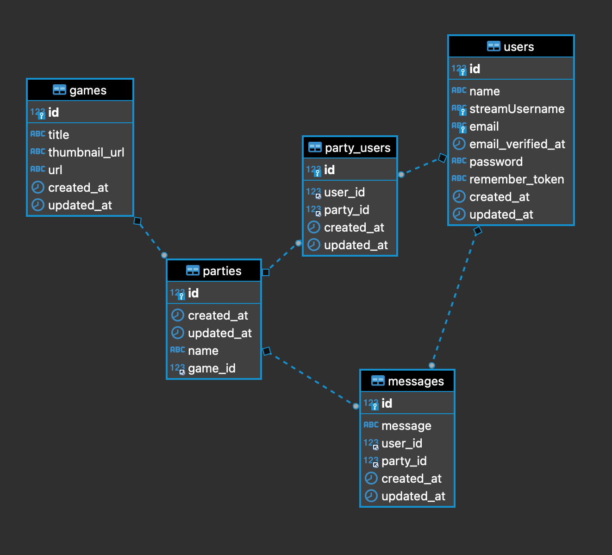

<h1 align="center">
   GAME'S CHAT BACKEND
</h1>

---

Challenge from the Fullstack Developer Bootcamp at <a href="https://geekshubsacademy.com/">GeeksHubs Academy</a>.

Starting date: July 7th 2021.  
Due date: July 19th 2021.

I used trello to to have a better organization.

## Instructions 🔧

The first step is to clone the repository and install the project dependencies in your local repository.

### `composer install`

Create the .env file and fill it with the values ​​from your database.

##### `DB_CONNECTION=mysql`
##### `DB_HOST=127.0.0.1`
##### `DB_PORT=3306`
##### `DB_DATABASE=laravel`
##### `DB_USERNAME=root`
##### `DB_PASSWORD=password`

Migrate the models to the database

### `php artisan migrate`

### `php artisan passport:install`

Run the server.

### `php artisan serve`

Finally, enter the endpoints petitions in Postman and send them.

## Endpoints

- Register
   - POST /api/register --> Register a new user and returns a token.

- Login
   - POST /api/login --> Login a created user and returns a token.

- User
   - GET /api/users --> Shows all the users. (Only allowed user with id=1)
   - GET /api/users/{ID} --> Shows one user by id. 
   - PUT /api/users/{ID} --> Updates user's information by id.
   - DELETE /api/users/{ID} --> Deletes a user by id.

- Party
   - POST /api/games --> Creates a new party. 
   - GET /api/games --> Shows all the parties. 
   - GET /api/games/title/{TITLE} --> Shows one party by title.
   - GET /api/games/{ID} --> Shows one party by id. (Only allowed user with id=1)
   - PUT /api/games/{ID} --> Updates party's information by id.
   - DELETE /api/games/{ID} --> Deletes a party by id. (Only allowed user with id=1)

- Games
   - POST /api/games --> Creates a new game. (Only allowed user with id=1)
   - GET /api/games --> Shows all the games. 
   - GET /api/games/title/{TITLE} --> Shows one game by title.
   - GET /api/games/{ID} --> Shows one game by id. (Only allowed user with id=1)
   - PUT /api/games/{ID} --> Updates game's information by id. (Only allowed user with id=1)
   - DELETE /api/games/{ID} --> Deletes a game by id. (Only allowed user with id=1)
   

## Models relation

## Used technologies

     

Installed dependencies: PASSPORT/LARAVEL 

## Developer ✍️

[Adriana Fayos](https://github.com/AdrianaFayos)

---